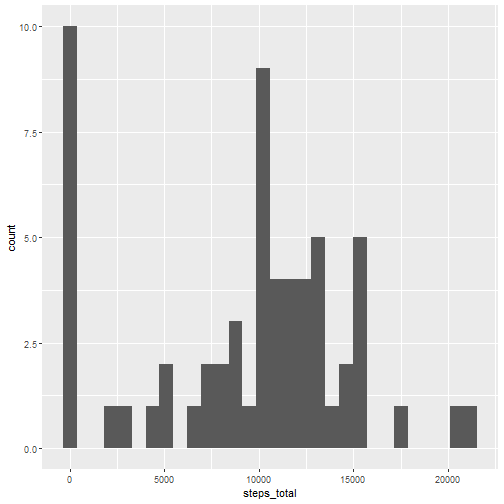
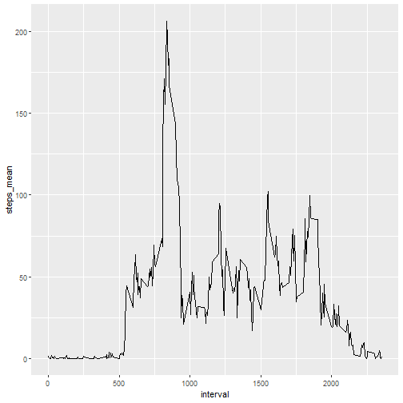
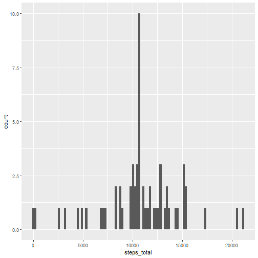
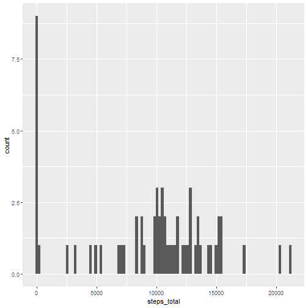
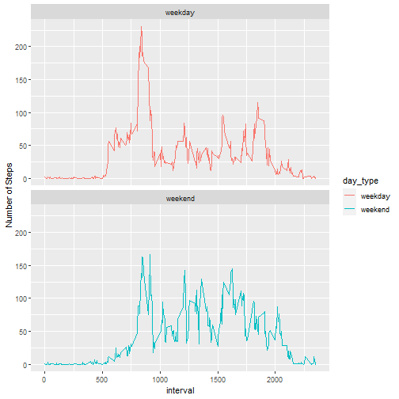

Libraries:


## Loading and preprocessing the data
Data was obtained forking the repository [https://github.com/rdpeng/RepData_PeerAssessment1](https://github.com/rdpeng/RepData_PeerAssessment1).


```r
df <- read.csv('./data/activity.csv')
```

Head and tail


```r
head(df)
```

```
##   steps       date interval
## 1    NA 2012-10-01        0
## 2    NA 2012-10-01        5
## 3    NA 2012-10-01       10
## 4    NA 2012-10-01       15
## 5    NA 2012-10-01       20
## 6    NA 2012-10-01       25
```

```r
tail(df)
```

```
##       steps       date interval
## 17563    NA 2012-11-30     2330
## 17564    NA 2012-11-30     2335
## 17565    NA 2012-11-30     2340
## 17566    NA 2012-11-30     2345
## 17567    NA 2012-11-30     2350
## 17568    NA 2012-11-30     2355
```

Table dimensions


```r
dim(df)
```

```
## [1] 17568     3
```

Structure of data


```r
str(df)
```

```
## 'data.frame':	17568 obs. of  3 variables:
##  $ steps   : int  NA NA NA NA NA NA NA NA NA NA ...
##  $ date    : chr  "2012-10-01" "2012-10-01" "2012-10-01" "2012-10-01" ...
##  $ interval: int  0 5 10 15 20 25 30 35 40 45 ...
```


Convert the variable 'date' to Date type:


```r
df$date <- as.Date(as.character(df$date), format = '%Y-%m-%d')
```
Summary


```r
summary(df)
```

```
##      steps             date               interval     
##  Min.   :  0.00   Min.   :2012-10-01   Min.   :   0.0  
##  1st Qu.:  0.00   1st Qu.:2012-10-16   1st Qu.: 588.8  
##  Median :  0.00   Median :2012-10-31   Median :1177.5  
##  Mean   : 37.38   Mean   :2012-10-31   Mean   :1177.5  
##  3rd Qu.: 12.00   3rd Qu.:2012-11-15   3rd Qu.:1766.2  
##  Max.   :806.00   Max.   :2012-11-30   Max.   :2355.0  
##  NA's   :2304
```

We can see that there 2304 missing values in the column 'steps.
The percentage of missing values is:


```r
mean(is.na(df$steps))
```

```
## [1] 0.1311475
```

## What is mean total number of steps taken per day?

`
Group steps by date and then summarize mean and sum:

```r
steps_day <- df %>% group_by(date) %>% summarise('steps_mean' = mean(steps, na.rm = T), 'steps_total' = sum(steps, na.rm = T))
```


Histogram of steps per day:


```r
p1 <- ggplot(steps_day, aes(x=steps_total)) 
p1 <- p1 + geom_histogram(bins = 30, na.rm = T)
p1
```



Mean and Median of steps:


```r
mean(steps_day$steps_total, na.rm = T)
```

```
## [1] 9354.23
```

```r
median(steps_day$steps_total, na.rm = T)
```

```
## [1] 10395
```


## What is the average daily activity pattern?


```r
steps_interval <- df %>% group_by(interval) %>% summarise('steps_mean' = mean(steps, na.rm = T), 'steps_median' = median(steps, na.rm = T))
summary(steps_interval)
```

```
##     interval        steps_mean       steps_median   
##  Min.   :   0.0   Min.   :  0.000   Min.   : 0.000  
##  1st Qu.: 588.8   1st Qu.:  2.486   1st Qu.: 0.000  
##  Median :1177.5   Median : 34.113   Median : 0.000  
##  Mean   :1177.5   Mean   : 37.383   Mean   : 3.962  
##  3rd Qu.:1766.2   3rd Qu.: 52.835   3rd Qu.: 0.000  
##  Max.   :2355.0   Max.   :206.170   Max.   :60.000
```
Plot: time series


```r
p2 <- ggplot(steps_interval, aes(x=interval, y=steps_mean))
p2 <- p2 + geom_line()
p2
```



Interval with maximum average of steps:


```r
steps_interval[which.max(steps_interval$steps_mean),]
```

```
## # A tibble: 1 × 3
##   interval steps_mean steps_median
##      <int>      <dbl>        <int>
## 1      835       206.           19
```

## Imputing missing values

###Replacing NA's with mean of interval:


```r
df1 <- left_join(df, steps_interval, by= "interval")
df1$steps_no_na <- ifelse(is.na(df1$steps), df1$steps_mean, df1$steps)

steps_day1 <- df1 %>% group_by(date) %>% summarise('steps_mean' = mean(steps_no_na, na.rm = T), 'steps_total' = sum(steps_no_na, na.rm = T))

summary(steps_day1)
```

```
##       date              steps_mean       steps_total   
##  Min.   :2012-10-01   Min.   : 0.1424   Min.   :   41  
##  1st Qu.:2012-10-16   1st Qu.:34.0938   1st Qu.: 9819  
##  Median :2012-10-31   Median :37.3826   Median :10766  
##  Mean   :2012-10-31   Mean   :37.3826   Mean   :10766  
##  3rd Qu.:2012-11-15   3rd Qu.:44.4826   3rd Qu.:12811  
##  Max.   :2012-11-30   Max.   :73.5903   Max.   :21194
```

Histogram of steps per day, after replacing NA's:


```r
p1 <- ggplot(steps_day1, aes(x=steps_total)) 
p1 <- p1 + geom_histogram(bins = 100, na.rm = T)
p1
```




Mean and Median of steps:


```r
mean(steps_day1$steps_total, na.rm = T)
```

```
## [1] 10766.19
```

```r
median(steps_day1$steps_total, na.rm = T)
```

```
## [1] 10766.19
```

Both mean and median increased.


###Replacing NA's with total of daily steps:


```r
df3 <- left_join(df, steps_day, by= "date")
df3$steps_no_na <- ifelse(is.na(df3$steps), df3$steps_total, df3$steps)

steps_day3 <- df3 %>% group_by(date) %>% summarise('steps_mean' = mean(steps_no_na, na.rm = T), 'steps_total' = sum(steps_no_na, na.rm = T))

summary(steps_day3)
```

```
##       date              steps_mean     steps_total   
##  Min.   :2012-10-01   Min.   : 0.00   Min.   :    0  
##  1st Qu.:2012-10-16   1st Qu.:23.53   1st Qu.: 6778  
##  Median :2012-10-31   Median :36.09   Median :10395  
##  Mean   :2012-10-31   Mean   :32.48   Mean   : 9354  
##  3rd Qu.:2012-11-15   3rd Qu.:44.48   3rd Qu.:12811  
##  Max.   :2012-11-30   Max.   :73.59   Max.   :21194
```

Histogram of steps per day, after replacing NA's:


```r
p3 <- ggplot(steps_day3, aes(x=steps_total)) 
p3 <- p3 + geom_histogram(bins = 100, na.rm = T)
p3
```




Mean and Median of steps:


```r
mean(steps_day3$steps_total, na.rm = T)
```

```
## [1] 9354.23
```

```r
median(steps_day3$steps_total, na.rm = T)
```

```
## [1] 10395
```


## Are there differences in activity patterns between weekdays and weekends?


```r
df4 <- df1[,c(2,3,6)]
df4$wday <- wday(df4$date, week_start = 1)
df4$weekday <- weekdays(df4$date)
df4$day_type <- as.factor(ifelse((df4$wday<6), 'weekday', 'weekend'))
```

Group df4 by interval and compute the mean:


```r
df4 <- df4 %>% group_by(day_type, interval) %>% summarise('steps_no_na_avg' = mean(steps_no_na))
```

```
## `summarise()` has grouped output by 'day_type'. You can override using the `.groups` argument.
```


Panel plot:


```r
p4 <- ggplot(df4, aes(interval, steps_no_na_avg, color = day_type, group = day_type))
p4 <- p4 + geom_line()
p4 <- p4 + ylab('Number of Steps')
p4 <- p4 + facet_wrap(vars(day_type), nrow = 2)
p4
```



